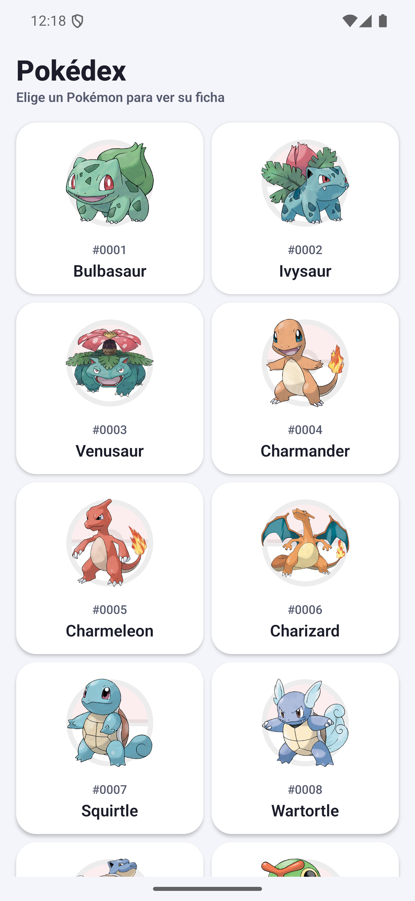
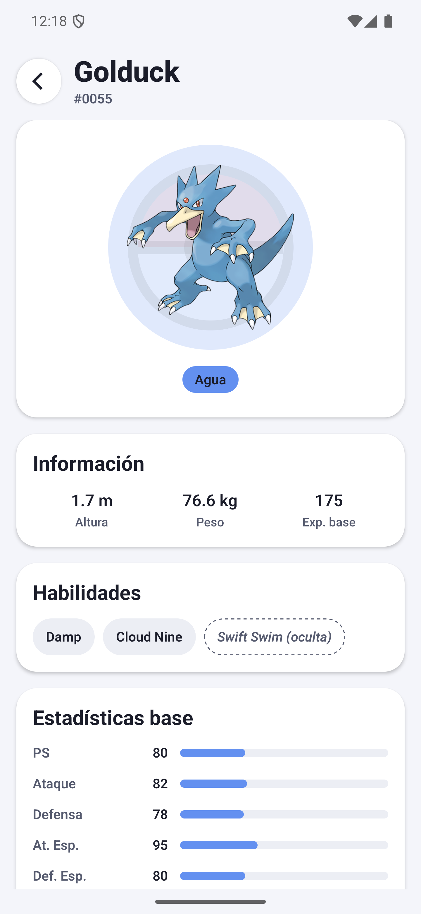
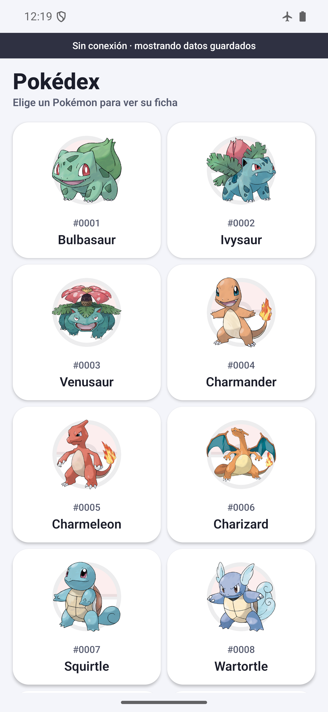

# Pokédex

App en React Native (CLI) con TypeScript que lista Pokémon desde [PokéAPI](https://pokeapi.co/) y muestra la ficha de cada uno. Guarda en el dispositivo lo que vas consultando, así que sigue funcionando sin internet con lo último que viste.

| Listado | Ficha | Sin conexión |
|---|---|---|
|  |  |  |

## Cómo correrlo

Necesitas Node 18 o superior. Para Android, JDK 17 y el SDK 36. Para iOS, Xcode y CocoaPods.

```bash
npm install
cd ios && pod install && cd ..   # solo iOS
```

```bash
npm start           # Metro
npm run android     # en otra terminal
npm run ios
```

Otros scripts: `npm test` (155 pruebas), `npm run test:coverage`, `npm run lint`, `npm run typecheck` y `npm run format:check`. Los mismos cuatro corren en GitHub Actions con cada push y pull request.

## Cómo está organizado

Separé el proyecto en capas para que la lógica de negocio no dependa de la API ni de la UI:

```
src/
  domain/        modelos, enums, el contrato del repositorio y reglas puras
  data/          DTOs de la API, mappers, fuentes remota y local, repositorio
  application/   casos de uso: la única puerta de la UI hacia los datos
  presentation/  pantallas, ViewModels, navegación, componentes y tema
  core/          cliente HTTP, almacenamiento, conectividad y errores
  app/           composición: QueryClient, registro de pantallas, arranque
```

`domain` no importa nada de React ni de red: son modelos, enums y el contrato `PokemonRepository`. `data` lo implementa y traduce lo que devuelve PokéAPI. La pantalla nunca llama a la API: el camino siempre es `Screen → ViewModel → caso de uso → repositorio → fuente remota o local`.

Cada pantalla son cuatro archivos: la vista (`PokemonListScreen.tsx`), su ViewModel (`usePokemonListViewModel.ts`), la interfaz del ViewModel y los estilos. La vista solo pinta lo que recibe; no calcula nada ni decide qué mostrar. El ViewModel entrega textos ya formateados, colores y etiquetas de accesibilidad.

Para que las vistas no se llenaran de condicionales, el estado de cada pantalla se resuelve con una tabla de reglas (`resolveScreenStatus`) y se pinta con `QueryStateView`, que asocia cada estado con su componente.

Los modelos, interfaces, types, enums y constantes viven en carpetas propias dentro de cada capa, un archivo por cosa. Los componentes siguen el mismo criterio: carpeta propia con `.tsx`, `.styles.ts` y `.types.ts`, y si tienen lógica, va en un hook aparte.

## Decisiones

**Sin inyección de dependencias.** No usé contenedor ni inyección por constructor. Cada módulo importa su implementación concreta, pero siempre tipada contra una interfaz (`pokemonRepository: PokemonRepository`, `keyValueStorage: KeyValueStorage`). Cambiar una implementación es cambiar un import, y en las pruebas se reemplaza con `jest.mock`. El costo es que los casos de uso conocen la implementación del repositorio; con factories se invertiría esa dependencia.

**Navegación propia.** El stack está hecho con `useReducer`, contexto y `Animated`: rutas y parámetros tipados, transición deslizante, botón atrás de Android y las pantallas anteriores siguen montadas, así que la lista conserva el scroll al volver.

**Persistencia: primero la red, con respaldo local.** Está en `data/policies/networkFirst.ts` y funciona así:

1. Si no hay internet, devuelve lo guardado de inmediato, sin intentar la red.
2. Si hay, consulta PokéAPI con un límite de 8 segundos y guarda la respuesta en AsyncStorage.
3. Si la petición falla, devuelve lo último guardado. Solo muestra error cuando nunca se guardó nada.

Elegí este orden porque los datos de Pokémon casi no cambian: mostrar lo último visto es seguro y siempre se intenta refrescar. Guardo modelos de dominio y no respuestas crudas, así ocupan menos y no dependen del formato de la API. Las claves llevan versión (`@pokedex/v1/...`), de modo que si cambio el modelo, lo viejo se ignora. Si una escritura falla, la app sigue igual: el almacenamiento es solo un respaldo. Ni la UI ni TanStack Query saben que AsyncStorage existe.

**Detectar que no hay red.** NetInfo comprueba si de verdad hay internet haciendo una petición a PokéAPI, no solo si el Wi-Fi está conectado. Así distingue el caso de estar conectado a una red sin salida. Con red lenta, el límite de 8 segundos evita que la pantalla se quede cargando. Esa misma señal alimenta a TanStack Query, así que al volver la conexión las consultas se refrescan solas y el aviso desaparece.

Sin conexión: abres la app y ves las páginas que ya visitaste; si llegas al final de lo guardado, aparece un aviso al pie con botón de reintentar y la lista se conserva; una ficha ya vista se abre completa y una que nunca abriste muestra un mensaje claro.

**Errores en un solo lugar.** Todos pasan por `toAppError`, que los clasifica en seis tipos: sin conexión, tiempo agotado, red, no encontrado, servidor y desconocido. La UI traduce cada tipo a un mensaje en español con botón de reintentar. Solo se reintentan solos los de red y servidor; no tiene sentido reintentar un 404.

**Accesibilidad.** Roles, etiquetas y pistas en tarjetas, botones y encabezados. Las barras de estadísticas se leen como barras de progreso con su valor. Calculé el contraste de todos los colores: el mínimo es 5.0:1 y el nivel AA pide 4.5:1. Las áreas táctiles son de al menos 44 pt y el texto crece con el ajuste del sistema. Las pantallas de atrás quedan ocultas para el lector de pantalla y el aviso de "Sin conexión" se anuncia solo.

**Rendimiento.** Lista virtualizada con `FlatList`, tarjetas con `React.memo`, callbacks estables, transformación de datos fuera del componente, caché en memoria (5 minutos frescos, 30 en memoria) además de la caché en disco, y animaciones con native driver donde se puede.

## Librerías

El documento pide no usar librerías externas y también permite elegirlas justificándolas. Me quedé con tres, cada una por algo que React Native no trae:

| Librería | Por qué |
|---|---|
| `@tanstack/react-query` | Caché, estados de carga y error, reintentos, scroll infinito y refresco al reconectar. Escribir todo eso a mano no aporta nada al reto. |
| `@react-native-async-storage/async-storage` | React Native lo incluía hasta la versión 0.60 y lo movió al repositorio de la comunidad como reemplazo oficial. Sin esto no hay persistencia. |
| `@react-native-community/netinfo` | React Native no expone el estado de la conexión, y lo necesito para saber si hay internet real. |

Lo demás está hecho con React Native y TypeScript: la navegación, los skeletons, las animaciones, la Pokébola (dibujada con `View`) y el manejo de áreas seguras, que en Android resolví aplicando los márgenes del sistema en `MainActivity.kt` porque de Android 15 en adelante la app se dibuja bajo las barras.

TypeScript, Jest, ESLint y Prettier son herramientas de desarrollo y no van dentro de la app.

## Pruebas

155 pruebas en 17 archivos. Cubren los mappers, la política de red con respaldo local, el cliente HTTP (incluido el timeout), el reducer de navegación, los formateadores y los dos ViewModels corriendo con TanStack Query real.

```bash
npm test
```

## Pendientes y trade-offs

- Los casos de uso dependen de la implementación concreta del repositorio, por no usar inyección de dependencias.
- Las imágenes sin conexión dependen de la caché nativa de `Image`. Casi siempre están, pero no hay garantía; si alguna no carga, queda visible la Pokébola de fondo.
- Con internet siempre consulto la API. Si el tráfico importara, serviría primero lo guardado durante un tiempo configurable.
- No hay búsqueda ni filtro por tipo. El repositorio ya permite agregarlos sin tocar la UI.
- La app usa solo tema claro.
- Lo probé en Android (Pixel 7 Pro, API 36). En iOS no alcancé a probarlo.
